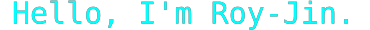

<Picture style="height: 30px;">
<source srcset="./profile/title.svg" type="image/svg">
<source srcset="https://glitch-art.vercel.app/api/simple?word=Hello,%20I'm%20Roy-Jin.&fontSize=30&width=370&height=30&font=Doto&fontWeight=500" type="image/svg">

</Picture>

☕ Coffee is bitter, Life is sweet.

