# 

<picture>
  <!-- <source
    srcset="https://github-readme-stats.vercel.app/api/top-langs/?username=Roy-Jin&layout=pie&custom_title=What%20Languages%20I%20Use%3F&theme=radical"
    media="(prefers-color-scheme: dark)" />
  <source
    srcset="https://github-readme-stats.vercel.app/api/top-langs/?username=Roy-Jin&layout=pie&custom_title=What%20Languages%20I%20Use%3F&theme=ambient_gradient"
    media="(prefers-color-scheme: light), (prefers-color-scheme: no-preference)" /> -->
  
</picture>

> ☕ **Coffee is bitter, Life is sweet.**

### 🚀 About Me

- 🌏 I'm from Jiujiang City, China.
- 🔭 Passionate about web development and open source.
- 🌱 Currently learning new technologies.
- 💡 Enjoy solving problems with code.

### 📫 Directions

- 🌐 [https://r-j.pages.dev](https://r-j.pages.dev/)
- ✉️ [JinRoy@outlook.com](mailto:JinRoy@outlook.com)
- 🐧 [//qm.qq.com/q/2Qaj5mB6Jq](https://qm.qq.com/q/2Qaj5mB6Jq)
- 📺 [//space.bilibili.com/3461572714302163](https://space.bilibili.com/3461572714302163)
